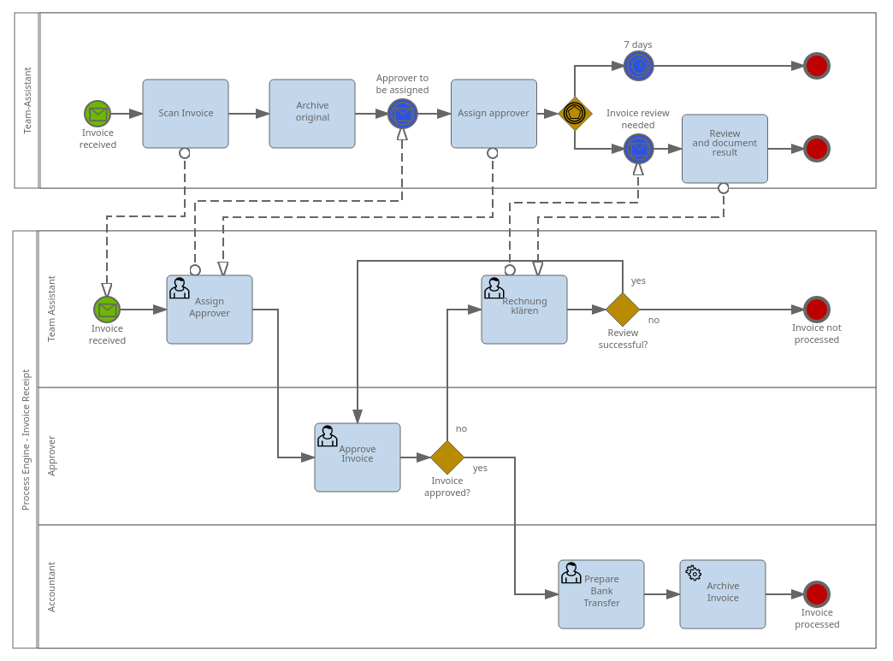
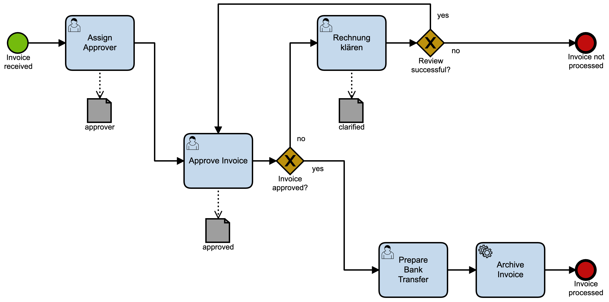
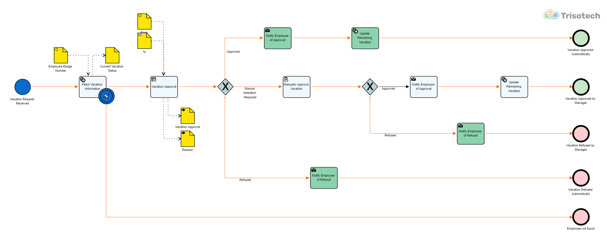
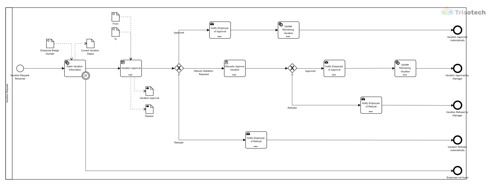

**Quick links:** [How to test a tool?](#user-content-how-to-test-a-bpmn-tool-using-this-test-suite) -> [Test Results](http://bpmn-miwg.github.io/bpmn-miwg-tools/)

**Table of Contents**  *generated with [DocToc](http://doctoc.herokuapp.com/)*

- [BPMN Model Interchange Test Suite](#user-content-bpmn-model-interchange-test-suite)
	- [Call for Participation](#call-for-participation)
	- [Test results of BPMN 2.0 tools that participated in the tests](#test-results-of-bpmn-20-tools-that-participated-in-the-tests)
	- [How to test a BPMN tool using this test suite?](#user-content-how-to-test-a-bpmn-tool-using-this-test-suite)
		- [1. Download Test Cases](#user-content-1-download-test-cases)
		- [2. Test Import, Export and/or Roundtrip of BPMN Models.](#user-content-2-test-import-export-andor-roundtrip-of-bpmn-models)
		- [3. Submit Your Test Results to BPMN MIWG](#user-content-3-submit-your-test-results-to-bpmn-miwg)
	- [Detailed Description of Test Procedures](#user-content-detailed-description-of-test-procedures)
		- [1. BPMN MIWG Import Test Procedure](#user-content-1-bpmn-miwg-import-test-procedure)
		- [2. BPMN MIWG Export Test Procedure](#user-content-2-bpmn-miwg-export-test-procedure)
		- [3. BPMN MIWG Roundtrip Test Procedure (BPMN Import and Export combined)](#user-content-3-bpmn-miwg-roundtrip-test-procedure-bpmn-import-and-export-combined)
		- [4. Optional: BPMN MIWG Cross Test Procedure (BPMN Roundtrip with results of other tools)](#user-content-4-optional-bpmn-miwg-cross-test-procedure-bpmn-roundtrip-with-results-of-other-tools)
		- [5. BPMN Import and Export not supported](#user-content-5-bpmn-import-and-export-not-supported)
	- [Repository Structure](#user-content-repository-structure)
	- [Verified Reference Models](#verified-reference-models)

BPMN Model Interchange Test Suite
=================================

BPMN 2.0 Test Cases (Models, Diagrams, Serializations) created by the BPMN Model Interchange Working Group (BPMN MIWG) at the OMG. For more information see: http://www.omgwiki.org/bpmn-miwg

Call for Participation
----------------------

If BPMN interchange is important to you:

 - [Test your favorite BPMN tool!](#user-content-how-to-test-a-bpmn-tool-using-this-test-suite) Users can also submit test results. You don't need to be the author of a tool to test it.
 - [Join the Group!](http://www.omgwiki.org/bpmn-miwg/doku.php#requirements_of_participation_and_how_to_join) Everybody can join. There is no need to be an OMG member. Get in touch with the people behind the standards.
 - Make yourself heard with your vendor.
 - Spread the word and share [the test results](http://bpmn-miwg.github.io/bpmn-miwg-tools/) with your peers.

Test results of BPMN 2.0 tools that participated in the tests
-------------------------------------------------------------

[](http://bpmn-miwg.github.io/bpmn-miwg-tools/)


How to test a BPMN tool using this test suite?
----------------------------------------------
Everybody is welcome to test BPMN tools and submit results to the working group, not just tools vendors but also end users that have access to a tool.

Here is how you do it:

### 1. Download Test Cases
First download the [latest version of the BPMN Model Interchange Test Suite](https://github.com/bpmn-miwg/bpmn-miwg-test-suite/archive/master.zip) and unpack it.
There is a directory called `Reference`, which contains the files needed for testing.
Next to that, there will be multiple folders with test results of other tools.

### 2. Test Import, Export and/or Roundtrip of BPMN Models.
There are [different test procedures](#detailed-description-of-test-procedures) that can be performed
with the provided reference models depending on the capabilities of the tool.
You will find explanations of these procedures [below](#detailed-description-of-test-procedures).

### 3. Submit Your Test Results to BPMN MIWG
Package all result files in a zip file and send it via email to [MIWG@trisotech.com](mailto:MIWG@trisotech.com). Please use the following template for your email:

```
Vendor: 
Tool name: 
Version: 
Website: 
Tool supports BPMN 2.0: 
Tool has BPMN XML import: 
Tool has BPMN XML export: 
Tool supports BPMN XML roundtrip: 
License: 
Notes: 
```

Alternatively, you may also [fork the repository](https://github.com/bpmn-miwg/bpmn-miwg-test-suite/fork_select) on GitHub, [upload the files using your Web browser](https://help.github.com/articles/adding-a-file-to-a-repository/)
and submit test results through a [pull request](https://github.com/bpmn-miwg/bpmn-miwg-test-suite/pull/new/master). If you do so, make sure to update the [JSON file with the list of tools](https://github.com/bpmn-miwg/bpmn-miwg-test-suite/blob/master/tools-tested-by-miwg.json).

Usually one day after your submission our [automated tools](https://github.com/bpmn-miwg/bpmn-miwg-tools)
should have generated a [report that shows findings in your submitted files](http://bpmn-miwg.github.io/bpmn-miwg-tools/):

[](http://bpmn-miwg.github.io/bpmn-miwg-tools/)

Note: By submitting test results you agree that they will be published under a <a rel="license" href="http://creativecommons.org/licenses/by/3.0/deed.en_CA">Creative Commons Attribution 3.0 Unported License</a>.


Detailed Description of Test Procedures
--------------------------------------

<table>
  <tr>
    <th>Available Features</th>
    <th>Possible Tests</th>
  </tr>
  <tr>
    <td>import only</td>
    <td>import, cross</td>
  </tr>
  <tr>
    <td>export only</td>
    <td>export</td>
  </tr>
  <tr>
    <td>import & export</td>
    <td>import, export, roundtrip, cross</td>
  </tr>
</table>

### 1. BPMN MIWG Import Test Procedure
If the tool under test supports the import of BPMN XML files, you can test that feature using the following procedure:

1. **Import** the BPMN XML file (*.bpmn) provided with a [reference model](#1-download-test-cases) into the tool, e.g. `A.1.0.bpmn`.
1. **Save the graphical representation** of the model as imported to a file named `<test id>-import.<diagramNumber>.png`, e.g. `A.1.0-import.1.png`.
You can either do that through an export feature of the tool or by taking a screenshot of the canvas. It needs to be saved in PNG format. The `<diagramNumber>` should be counted in the order in which the diagrams appear inside reference XML file.
1. **Compare** the result with the image provided with the reference model, e.g. `A.1.0.png`.
1. **Report any findings** by [creating new issues](https://github.com/bpmn-miwg/bpmn-miwg-test-suite/issues/new) on GitHub – one for each finding. Here is a template for your issue reports:

```
Tool name: 
Tool version: 
Test case id: 
Test procedure: import
Description: 
```

Repeat these steps for all reference models and [submit your result files to BPMN MIWG](#3-submit-your-test-results-to-bpmn-miwg).

### 2. BPMN MIWG Export Test Procedure
If the tool under test supports the export of BPMN XML files, you can test that feature using the following procedure:

1. **Draw** the model as shown in the image provided with a [reference model](#1-download-test-cases) into the tool, e.g. `A.1.0.png`.
1. **Save the graphical representation** of the model as drawn to a file named `<test id>-export.png`, e.g. `A.1.0-export.png`.
You can either do that through an export feature of the tool or by taking a screenshot of the canvas. It needs to be saved in PNG format.
1. **Export** the model into a BPMN XML file (*.bpmn) named `<test id>-export.bpmn`, e.g. `A.1.0-export.bpmn`.
1. **Compare** the result with the BPMN XML file (*.bpmn) provided with the reference model, e.g. `A.1.0.bpmn`.
1. **Report any findings** by [creating new issues](https://github.com/bpmn-miwg/bpmn-miwg-test-suite/issues/new) on GitHub – one for each finding. Here is a template for your issue reports:

```
Tool name: 
Tool version: 
Test case id: 
Test procedure: export
Description: 
```

Repeat these steps for all reference models and [submit your test results to BPMN MIWG](#3-submit-your-test-results-to-bpmn-miwg).

### 3. BPMN MIWG Roundtrip Test Procedure (BPMN Import and Export combined)
If the tool under test supports the import and export of BPMN XML files, you can test a roundtrip using the following procedure:

1. **Import** the BPMN XML file (*.bpmn) provided with a [reference model](#1-download-test-cases) into the tool, e.g. `A.1.0.bpmn`.
1. If not already done during an import test, **save the graphical representation** of the model as it is imported to a file named `<test id>-import.<diagramNumber>.png`, e.g. `A.1.0-import.1.png`.
You can either do that through an export feature of the tool or by taking a screenshot of the canvas. It needs to be saved in PNG format. The `<diagramNumber>` should be counted in the order in which the diagrams appear inside reference XML file.
1. **Export** the model into a BPMN XML file (*.bpmn) named `<test id>-roundtrip.bpmn`, e.g. `A.1.0-roundtrip.bpmn`.
1. **Compare** the result with the BPMN XML file (*.bpmn) provided with the reference model, e.g. `A.1.0.bpmn`.
1. **Report any findings** by [creating new issues](https://github.com/bpmn-miwg/bpmn-miwg-test-suite/issues/new) on GitHub – one for each finding. Here is a template for your issue reports:

```
Tool name: 
Tool version: 
Test case id: 
Test procedure: roundtrip
Description: 
```

Repeat these steps for all reference models and [submit your test results to BPMN MIWG](#3-submit-your-test-results-to-bpmn-miwg).

### 4. Optional: BPMN MIWG Cross Test Procedure (BPMN Roundtrip with results of other tools)
If the tool under test supports at least the import of BPMN XML files, you may optionally do a cross test with the roundtrip and export test results submitted by other tools:

1. **Import** the BPMN XML files (*.bpmn) exported from other tools as their [test results](#1-download-test-cases) into the tool, e.g. `A.1.0-roundtrip.bpmn` or `A.1.0-export.bpmn` from the folder of the other tool, e.g. `camunda Modeler 2.4.0`.
1. **Save the graphical representation** of the model as imported to a file named `<name of imported file>-import.<diagramNumber>.png`, e.g. `A.1.0-roundtrip-import.1.png` or `A.1.0-export-import.1.png`.
You can either do that through an export feature of the tool or by taking a screenshot of the canvas. It needs to be saved in PNG format. The `<diagramNumber>` should be counted in the order in which the diagrams appear inside reference XML file.
Store the result file in a folder with the name and version of the other tool that exported the file, e.g. `camunda Modeler 2.4.0`.
1. **Export** the model into a BPMN XML file (*.bpmn) named `<name of imported file>-roundtrip.bpmn`, e.g. `A.1.0-roundtrip-roundtrip.bpmn` or `A.1.0-export-roundtrip.bpmn`.
Store the result file in a folder with the name and version of the other tool that exported the file, e.g. `camunda Modeler 2.4.0`.
1. **Compare** the result with the BPMN XML file (*.bpmn) provided with the reference model, e.g. `A.1.0.bpmn`, and/or the imported file, e.g. `A.1.0-roundtrip.bpmn` or `A.1.0-export.bpmn`.
1. **Report any findings** by [creating new issues](https://github.com/bpmn-miwg/bpmn-miwg-test-suite/issues/new) on GitHub – one for each finding. Here is a template for your issue reports:

```
Tool name: 
Tool version: 
Name of imported file: 
Tool name of imported file: 
Tool version of imported file: 
Test procedure: cross
Description: 
```

Repeat these steps for all roundtrip and export test results of all tools and [submit your test results to BPMN MIWG](#3-submit-your-test-results-to-bpmn-miwg).

### 5. BPMN Import and Export not supported
If the tool does neither support import nor export of BPMN XML files you can not perform the tests described above. However, if the tool supports other model interchange formats, we are still interested to record this information:

1. Create a [new issue on GitHub](https://github.com/bpmn-miwg/bpmn-miwg-test-suite/issues/new)  with a text like:

```
Tool name: 
Tool version: 
Description:
   The BPMN XML format is not supported.
   Model Interchange is only possible in the `XPDL` format.

```

## Naming Conventions

The name and version of a tool must be the same across folder name, issue label name, and entry in JSON file
[tools-tested-by-miwg.json](https://github.com/bpmn-miwg/bpmn-miwg-test-suite/blob/master/tools-tested-by-miwg.json).

For example:
- Folder name: [IBM Process Designer 8.0.1](https://github.com/bpmn-miwg/bpmn-miwg-test-suite/tree/master/IBM%20Process%20Designer%208.0.1) 
- Issue label: [Tool: IBM Process Designer](https://github.com/bpmn-miwg/bpmn-miwg-test-suite/labels/Tool%3A%20IBM%20Process%20Designer)
- JSON entry:

```json
    {
      "vendor": "IBM",
      "tool": "IBM Process Designer",
      "version": "8.0.1",
      ...
    }
```


Repository Structure
--------------------

The top level is either a vendor or the submitted reference. 
The second level holds the individual test case files in the form `<identifier>-<test type>.filetype`.

The vendor who provided the reference model for a test case will be identified in the file `test-case-structure.json`.

- README.md (this file)
- [test-case-structure.json](https://github.com/bpmn-miwg/bpmn-miwg-test-suite/blob/master/test-case-structure.json) <-- list of test cases
- [tools-tested-by-miwg.json](https://github.com/bpmn-miwg/bpmn-miwg-test-suite/blob/master/tools-tested-by-miwg.json) <-- list of tested tools
- Reference <-- reference files for testing
  - A.1.0.png
  - A.1.0.bpmn <-- look in spreadsheet `test-case-structure.json` to find vendor who provided this reference
  - ...
- Trisotech BPMN Web Modeler 4.1.8 <-- test results
  - A.1.0-import.1.png
  - A.1.0-export.png
  - A.1.0-export.bpmn
  - A.1.0-roundtrip.bpmn
  - ...
  - camunda Modeler 2.4.0 <-- cross test results
    - A.1.0-roundtrip-import.1.png
    - A.1.0-roundtrip-roundtrip.bpmn
    - ...
  - MID Innovator 11.5.1.30223 <-- cross test results
    - A.1.0-export-import.1.png
    - A.1.0-export-roundtrip.bpmn
    - ...
  - ...
- camunda Modeler 2.4.0 <-- test results
  - A.1.0-import.1.png
  - A.1.0-roundtrip.bpmn
  - ...
  - Trisotech BPMN Web Modeler 4.1.8 <-- cross test results
    - A.1.0-export-import.1.png
    - A.1.0-export-roundtrip.bpmn
    - A.1.0-roundtrip-import.1.png
    - A.1.0-roundtrip-roundtrip.bpmn
    - ...
  - ...
- MID Innovator 11.5.1.30223 <-- test results
  - A.1.0-import.1.png
  - A.1.0-export.bpmn
  - ...

Verified Reference Models
-------------------------

### A.1.0
_Depict Abstract Elements on a single Sequential Flow_


### A.2.0
_Depict divergence and convergence of flows with unmarked Gateways_


### A.2.1
_Depict divergence and convergence of flows with unmarked Gateways using different type of sequence flows_


### A.3.0
_Depict Exception Flows associated to boundary attachments_


### A.4.0
_Depict graphical elements contained in expanded Sub-Processes, Lanes and Pools_


### A.4.1
_Vertical Modeling Direction_


### B.1.0
_Descriptive Sub-Class (Conformance class coverage) - Validate that all the elements prescribed for the Descriptive Conformance Sub-Class in the BPMN 2.0 Specification are present._


### B.2.0
_Analytic Sub-Class (Conformance class coverage) - Validate that all the elements prescribed for the Analytic Conformance Sub-Class in the BPMN 2.0 Specification are present._


### C.1.0
_Invoice Collaboration - Executable process containing multiple extension elements and attributes (derived from 2013 Demo in Berlin)_



### C.1.1
_Invoice Collaboration - Process from 2015 Execution Demo in Berlin that can be executed in Camunda BPM, OmnyLink and W4 BPMN+_



### C.2.0
_Buying at Amazon Collaboration - Collaboration from 2015 Diagram Interchange Demo in Berlin_


### C.3.0
_Fridge Repair Service - Process with hidden BPMN attributes and elements from 2015 Hidden Attribute Demo in Berlin_


### C.4.0
_New Employee Onboarding - Process with signal and message events and multiple diagrams, from 2017 Demo in Brussels_

#### C.4.0 diagram 1

#### C.4.0 diagram 2

#### C.4.0 diagram 3

#### C.4.0 diagram 4


### C.5.0
_New Bank Customer - Process with data objects and stores and their hidden attributes from 2018 Demo in Seattle_
#### C.5.0 diagram 1

#### C.5.0 diagram 2


### C.6.0
_Travel Booking - Process with data input/outputs and event sub-process from 2019 Demo in Amsterdam_


### C.7.0
_Advertise a job vacancy - Process with data inputs and data object connected to sequence flow from 2020 Virtual Demo_


### C.8.0
_Vacation Request - Process with color and internationalization from 2022 Demo_



### C.8.1
_Vacation Request - Process with automation extensions from 2022 Demo_




<a rel="license" href="http://creativecommons.org/licenses/by/3.0/deed.en_CA"></a><br />This work is licensed under a <a rel="license" href="http://creativecommons.org/licenses/by/3.0/deed.en_CA">Creative Commons Attribution 3.0 Unported License</a>.
